# EdgeMind

**The AI that remembers you, even when the cloud can't reach you.**
An offline-first memory assistant for Code Cubicle 6.0, Problem Statement 3 (Qdrant Edge).

**Live demo:** [💻 Laptop](https://edgemind-production-fb04.up.railway.app/laptop/) · [📱 Phone](https://edgemind-production-fb04.up.railway.app/mobile/) (open on a phone) · [Both side by side](https://edgemind-production-fb04.up.railway.app/)

You tell EdgeMind things worth remembering, then ask it questions in plain language. Each device keeps its own semantic memory in an embedded **Qdrant Edge** shard and answers from it with an on-device model, **with or without a network**. Every note is either **Only me** (private: it never leaves the device) or **Team** (shareable: it syncs to your other devices through a central **Qdrant Server** whenever there is a connection). That boundary is enforced in code and can be audited from the UI.

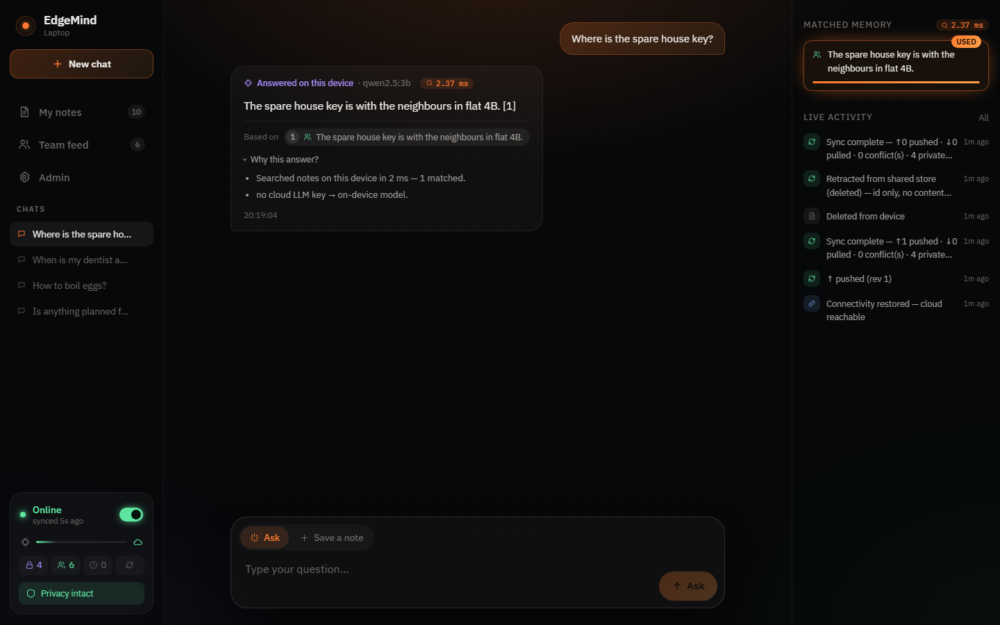

**Contents:** [Features](#features) · [How offline mode works](#how-offline-mode-works) · [How privacy stays intact](#how-privacy-stays-intact) · [The team feature](#the-team-feature) · [Quick start](#quick-start-windows) · [Deploy](#deploy-a-public-demo-link-docker) · [Demo script](#demo-script-4-minutes) · [Internals](#internals)

---

## Features

| | |
|---|---|
| **Ask in plain language** | Hybrid search (dense vectors + BM25, fused with RRF) runs on the device in milliseconds. The answer cites the notes it used, and *Why this answer?* explains who wrote it and why. |
| **Works offline** | Search, answers, and saving notes all run locally. The device switches to offline **automatically** when the internet drops, and you can also force it with a switch. |
| **Private by default where it matters** | *Only me* notes never leave the device, not even while online. Questions that touch them are answered on-device. |
| **Team sharing** | *Team* notes sync to every device through the shared Qdrant Server, with a live **Team feed** and an offline copy when disconnected. |
| **Evolving memory** | Saving a note similar to an old one asks whether it replaces it. Superseded notes are kept, but not used in answers. |
| **Conflicts handled, nothing lost** | Concurrent edits resolve by last write wins. The losing version is logged and can be restored in one click. |
| **Provable privacy** | Every outbound request is written to an egress ledger. A built-in audit checks private notes against that ledger **and** against the live server. |
| **Two form factors** | A desktop UI (**Laptop**, `:8101`) and a phone UI (**Mobile**, `:8102`), each with its own memory, syncing with each other. |

<table>
<tr>
<td width="68%">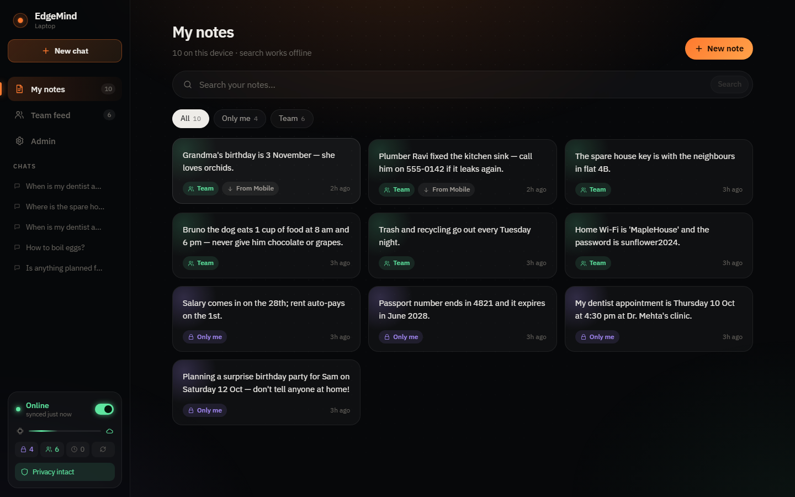</td>
<td width="32%">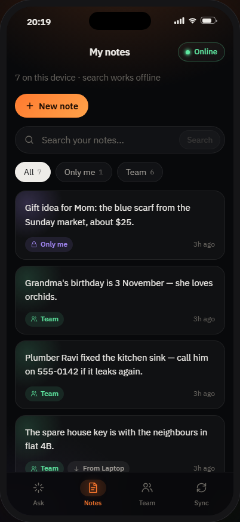</td>
</tr>
<tr>
<td><b>My notes</b> (laptop). Each note is tagged <i>Only me</i> (purple lock) or <i>Team</i> (green). Notes that came from another device say so (<i>From Mobile</i>).</td>
<td><b>My notes</b> (phone). The phone has its own private note (the gift idea), which the laptop never sees.</td>
</tr>
</table>

---

## How offline mode works

EdgeMind doesn't treat offline as an error state. It's designed to be fully usable with no connection, and the network only adds sync and an optional cloud model on top.

### Everything needed to answer lives on the device

```
 question ──► embed locally ──► hybrid search in the     ──► on-device LLM ──► answer + citations
             (nomic-embed-text)  Qdrant Edge shard            (qwen2.5:3b)
                                 dense + BM25, RRF fusion
```

| Piece | Where it runs | Needs a network? |
|---|---|---|
| Note storage | Qdrant Edge shard in `data/<device>/shard` | No |
| Embeddings | Ollama, `nomic-embed-text` (768-d) | No |
| Keyword search | Qdrant Edge's built-in BM25 | No |
| Answer generation | Ollama, `qwen2.5:3b` (phi3 as fallback) | No |
| Sync to other devices | Qdrant Server | Yes, and it's queued while offline |
| Cloud model (optional) | OpenAI | Yes, and it's skipped while offline |

<table>
<tr>
<td width="68%">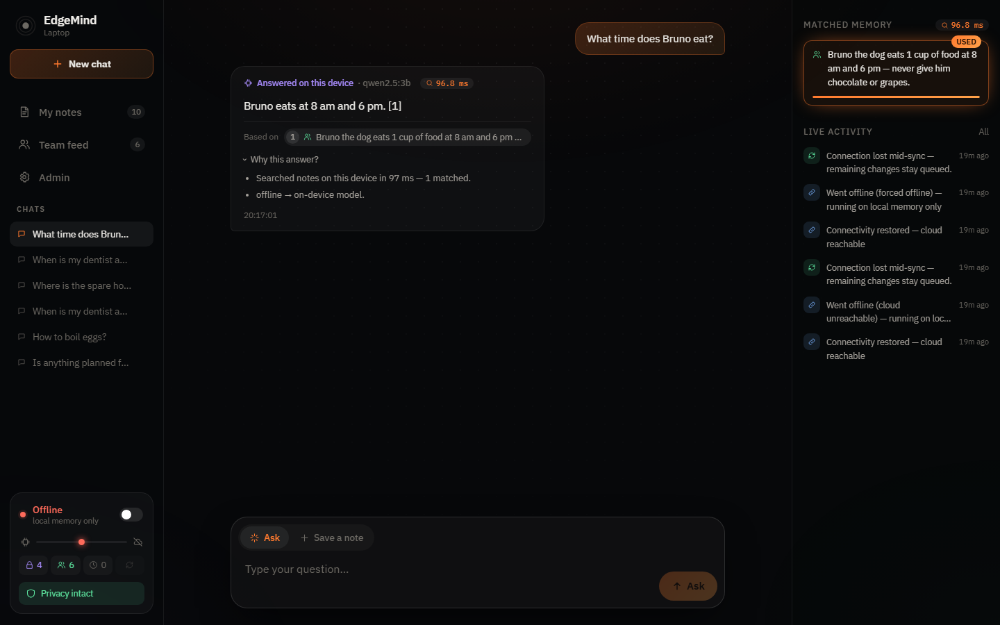</td>
<td width="32%">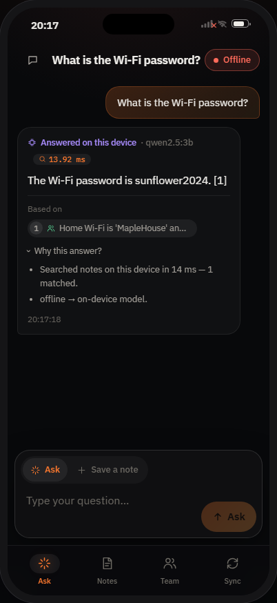</td>
</tr>
<tr>
<td><b>Offline on the laptop.</b> The status card at the bottom left reads <i>Offline · local memory only</i>. The note was found in 97 ms, and the answer is labelled <i>Answered on this device · qwen2.5:3b</i>. <i>Why this answer?</i> shows <code>offline → on-device model</code>.</td>
<td><b>Offline on the phone.</b> Same flow on the other device. The Wi-Fi password note was shared from the laptop earlier, so the phone can answer it with no connection.</td>
</tr>
</table>

### Going offline is detected automatically

Each device runs a connectivity probe (`edge/network.py`) every 2 seconds. A device counts as **online** only when all three are true:

1. the offline switch isn't on,
2. the Qdrant Server answers its health check, and
3. the internet is reachable: a bare TCP connect to `1.1.1.1:443` or `8.8.8.8:443`, which sends no payload and needs no DNS lookup (set with `INTERNET_CHECK`).

The browser also reports Wi-Fi changes instantly (`online`/`offline` events), and the page asks the device to re-probe straight away. So when the Wi-Fi drops, the UI flips to *Offline* within about a second, and in the worst case within about 3.5 seconds. When the connection returns, the device goes back online and syncs immediately.

### Notes you save offline wait in a queue

Saving a note never waits on the network. It is embedded and written to the local shard straight away, so you can search for it and ask about it at once. A *Team* note saved offline is marked **Waiting to sync**, and the sync channel in *Admin* shows the link cut. On reconnect the queue drains automatically.

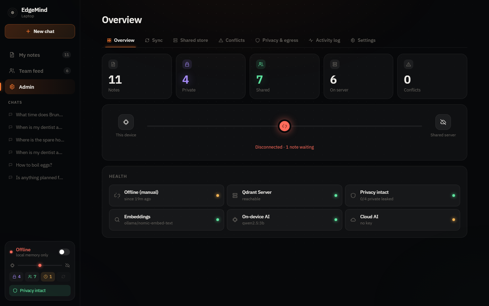

<table>
<tr>
<td width="68%">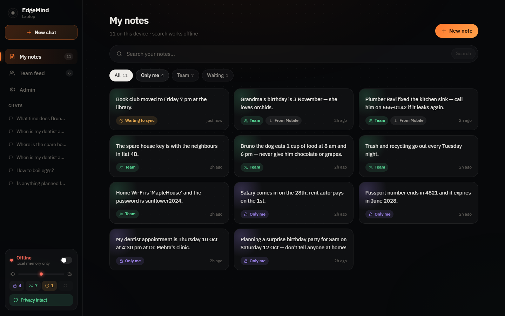</td>
<td width="32%">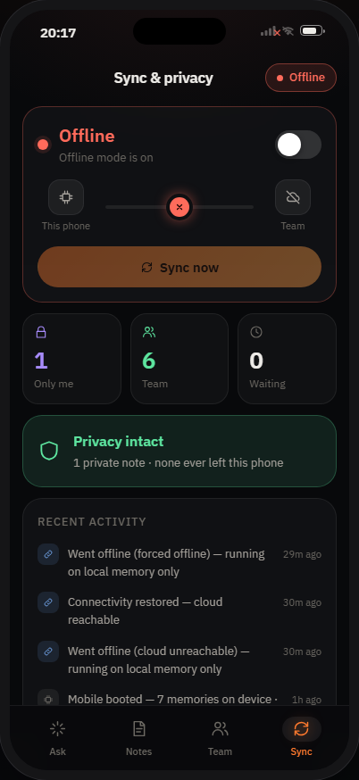</td>
</tr>
<tr>
<td>The new <i>Book club</i> note is usable at once, and is tagged <b>Waiting to sync</b> until the device reconnects.</td>
<td>The phone's <b>Sync</b> tab, offline: the link is cut, with counts per state and the privacy status.</td>
</tr>
</table>

### What happens when you ask

Retrieval always runs locally first. Then `plan_route()` in `edge/app.py` decides who writes the answer:

| Situation | Who answers |
|---|---|
| Offline (or no cloud key) and a note matches | On-device model, answering only from your notes and citing them |
| Offline and nothing matches | On-device model from general knowledge, labelled **General answer · not from your notes** |
| Online, a cloud key, and only *Team* notes match | Cloud model (Gemini, or OpenAI when no Gemini key is set) |
| Online, and any *Only me* note matches | On-device model: the private text never leaves (see [privacy](#how-privacy-stays-intact)) |
| Online and nothing matches | Cloud model from general knowledge. Only the question and non-private chat history are sent |
| The cloud call fails or the connection drops mid-answer | Rerouted to the on-device model, with the reason shown |
| No local model running | The matching notes are shown word for word, with nothing generated |

### Offline on the deployed link (in the browser)

Run locally, the "device" is your own computer (`localhost`), so turning the Wi-Fi off changes nothing: the browser still reaches it. A deployed link (Railway, Hugging Face, a VM) is different. With your internet off, the browser can't reach the server at all (`ERR_NAME_NOT_RESOLVED`), and neither can the server's notes or its model. So the page carries its own offline copy of the device's brain:

| Piece | What it does | Where it lives |
|---|---|---|
| App shell (service worker, `web/sw.template.js`) | The page itself opens with no internet | Browser Cache Storage |
| Copy of your notes and chats (`web/src/offline/local.js`) | Refreshed from the device on every online visit. Notes saved offline wait in an outbox and are sent when the device is reachable again | Browser Local Storage |
| Search (`web/src/offline/brain.js`) | Hybrid search over that copy: keywords, plus meaning once the search model is downloaded | Runs in the page |
| **Offline AI** | Writes answers from your notes, and general answers: the browser's built-in model when it has one, otherwise WebLLM on WebGPU | Built-in: the browser's own storage. WebLLM: Browser Cache Storage |

When a request to the device fails, `web/src/api.js` switches the page to browser mode, and the status card reads *Offline · running in this browser*. Without the Offline AI, offline answers show the matching notes word for word, and general questions get no written answer.

**Getting ready (once per browser, while online):**

1. Open the deployed link in a recent Chrome or Edge. The Offline AI needs WebGPU.
2. Go to **Admin › Offline AI** (on the phone: the **Sync** tab), pick **Small** or **Standard**, and press **Download**. Wait until it finishes.
3. Now go offline and reload. The page opens from the browser, and questions are answered on your computer.

**Built-in model first.** Recent desktop Chrome (Gemini Nano) and Edge (Phi-4 mini) ship a model through the Prompt API (`LanguageModel`). The page checks for it first. If it's ready, the page uses it and downloads nothing into the site; an earlier automatic WebLLM download is removed to free the space. If the browser can fetch its model but hasn't yet, it starts on the first click on the page. Only when the browser has no built-in model (phones, Firefox, Safari, too little disk or memory) does the page download a WebLLM model sized to the device. A model you pick by hand in Admin › Offline AI is always used instead of the built-in one.

**The models.** Each option has two builds of the same model. Graphics chips that support 16-bit maths (`shader-f16`, most recent laptops and phones) get `q4f16_1`, and older ones get `q4f32_1`. Sizes come from WebLLM 0.2.85 and Hugging Face.

| Option | Model | Download | Graphics memory while answering | Best for |
|---|---|---|---|---|
| Small | `Qwen2.5-0.5B-Instruct-q4f16_1-MLC` / `-q4f32_1-MLC` | 290 MB | ≈ 945 MB / ≈ 1,060 MB | Phones |
| Standard | `Qwen2.5-1.5B-Instruct-q4f16_1-MLC` / `-q4f32_1-MLC` | 880 MB | ≈ 1,630 MB / ≈ 1,890 MB | Laptops |
| Search model (always included) | `Xenova/all-MiniLM-L6-v2`, 8-bit, runs on the CPU | 23 MB | small | Both |

The models download from Hugging Face and stay inside the browser. You can see them under DevTools › Application › Cache Storage. **Remove download** deletes them.

**Storage and limits:**

- **Laptop:** the 0.3–0.9 GB sits in the browser cache. Chrome and Edge allow a site a large share of free disk, so this is rarely a problem.
- **Phone:** use Small. Standard needs about 1.6–1.9 GB of graphics memory, which phones with 6 GB of RAM or less often can't spare: the tab gets slow or crashes. Download on Wi-Fi.
- **The browser may delete the download.** The app doesn't request persistent storage, so a browser short on space can clear the cached model, and it then has to be downloaded again. Safari also deletes a site's data after 7 days without a visit.
- **Each browser keeps its own copy.** A browser that has never opened the link online has nothing to work with offline. After a new deploy, open the link online once so the browser picks up the new version.
- **Notes copy:** Local Storage holds about 5 MB per site, which is thousands of notes.
- **HTTPS is required.** Browsers only allow service workers on HTTPS sites (or `localhost`). Railway and Hugging Face provide HTTPS. A VM served on plain `http://<ip>` needs a domain and a certificate first.

---

## How privacy stays intact

Every note gets one of two labels when you save it:

- **Only me** (private): stays on this device. It isn't synced, isn't sent to the cloud model, and isn't in any outbound request.
- **Team** (shareable): synced to your other devices through the Qdrant Server, and usable as context for the cloud model.

A UI toggle alone would be easy to get wrong, so the boundary is enforced in **five layers of code**, and then **audited**.

### Layer by layer

1. **The sync query never selects private notes.** Sync status lives in an indexed keyword, `sync_state`. Only `queued` records are pushed, and a private record is always `private`, never `queued`.
2. **One serializer, with a hard guard.** `CloudStore.cloud_payload()` (`edge/cloud.py`) is the only function that turns a record into a cloud payload. It raises `PrivacyViolation` for any record that isn't shareable, and it builds the payload from an allow-list of fields rather than copying the record.
3. **One way out of the device.** Every outbound call, to the Qdrant Server or to OpenAI, must pass `NetworkGate.egress()` (`edge/network.py`). The gate blocks everything while offline, and writes each call to a persistent **egress ledger** along with the ids of the notes it carried.
4. **Private context never reaches the cloud model.** If any *Only me* note matches a question, the answer is written by the on-device model even while online. Chat turns derived from private context are also left out of later cloud prompts. There's an optional *withhold* policy under *Admin › Settings*, which sends the cloud only the shareable matches.
5. **Sharing can be undone.** If a *Team* note is re-tagged *Only me* or deleted, the server copy is replaced with a **tombstone**: the id is kept, but the text and vectors are wiped. Notes pulled from another device can't be re-tagged private, because that would silently delete them for their owner.

<table>
<tr>
<td>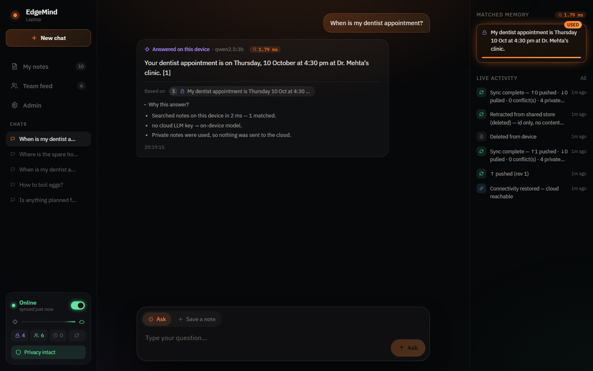</td>
</tr>
<tr>
<td><b>Private context, while online.</b> The laptop is online, but the dentist note is <i>Only me</i> (lock icon). So the answer is written on-device, and <i>Why this answer?</i> says <i>Private notes were used, so nothing was sent to the cloud.</i></td>
</tr>
</table>

### The audit: don't trust the code, check it

*Admin › Privacy & egress* (`/api/privacy/audit`) runs two independent checks:

- **Ledger check:** is any private note id in any outbound request ever made?
- **Server check:** is any private note id present on the live Qdrant Server? The device downloads the server's list of ids and compares them locally, so the audit itself sends nothing private.

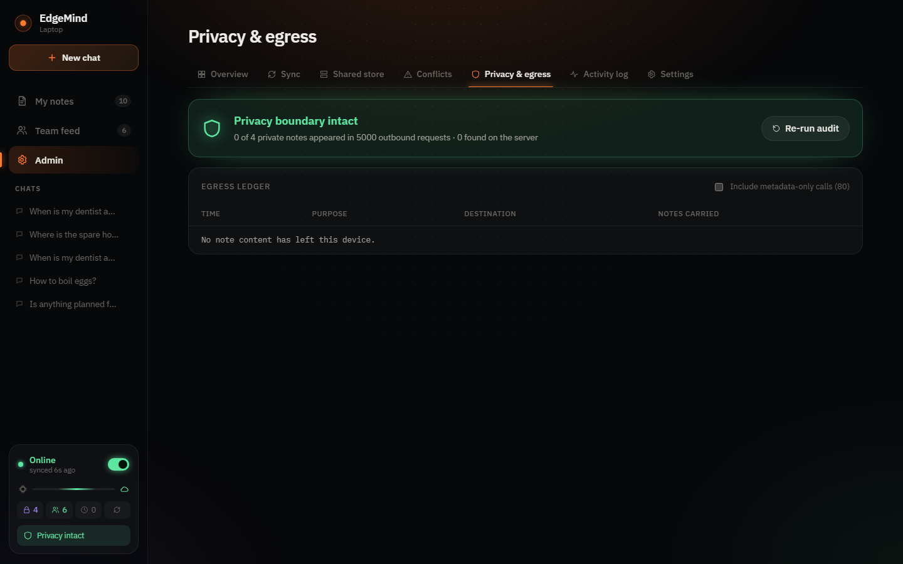

The same status appears as a **Privacy intact** badge on both devices, and on the phone's *Sync* tab ("none ever left this phone"). The end-to-end test (`scripts/e2e_test.py`) checks this boundary too, both offline and online.

---

## The team feature

*Team* notes are how devices share what they know. The demo runs two devices, a laptop and a phone, but each device is the same code started with its own id and its own data folder.

### How sharing works

```
 Laptop (device_a)                  Qdrant Server                   Mobile (device_b)
 ┌───────────────────┐   push      ┌──────────────────┐   pull     ┌───────────────────┐
 │ Team note  ───────┼────────────►│ edgemind_shared  │───────────►│ appears in notes, │
 │ Only me note  ✕   │  (queued    │ dense + sparse   │ (vectors   │ answers, and the  │
 │ (never leaves)    │   only)     │ vectors, rev #   │  included) │ Team feed         │
 └───────────────────┘             └──────────────────┘            └───────────────────┘
```

A sync runs on reconnect, every 8 seconds while online, and when you press **Sync now**. Each run does three things in order:

1. **Retract:** replaces anything un-shared or deleted with a tombstone on the server.
2. **Push:** uploads every queued *Team* note.
3. **Pull:** downloads new or edited notes from other devices, **with their vectors**, so the receiving device doesn't re-embed them and can search them offline at once.

Pulled notes live in the receiving device's own shard. So a phone that just synced can answer questions about the laptop's shared notes on a plane.

### Team feed

The **Team feed** lists everything your devices have shared, newest first, showing who shared each note and who last edited it. While online it's marked **Live**. While offline it shows the last synced copy (**Offline copy · 18m ago**) and stays readable.

<table>
<tr>
<td width="68%">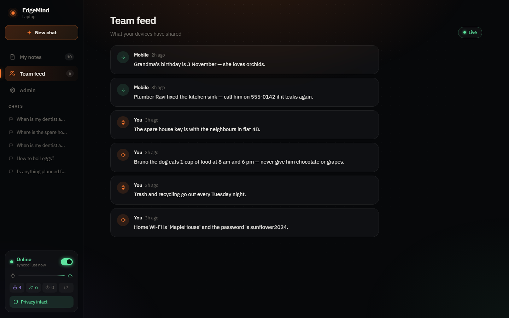</td>
<td width="32%">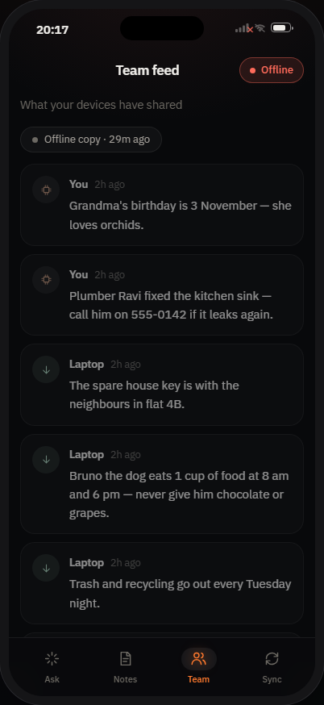</td>
</tr>
<tr>
<td><b>Team feed on the laptop.</b> <i>You</i> marks notes this device shared. <i>Mobile</i> marks notes pulled from the phone.</td>
<td><b>Team feed on the phone, offline.</b> The feed reads <i>Offline copy</i> and stays readable.</td>
</tr>
</table>

*Admin › Shared store* shows exactly what the server holds: each shared note, which device it came from, and its revision. The phone's private gift note and the laptop's four private notes are not in it.

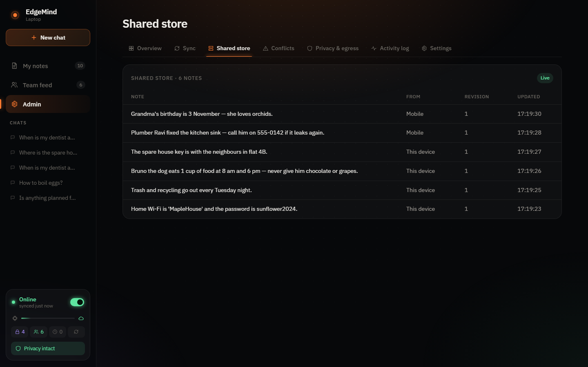

### Demo accounts: seven people, three teams, one link

Next to Laptop and Mobile, the demo has seven **accounts** in three teams. Everyone signs in at **one address**: http://localhost:8100 locally, or `/app/` (or `/login`) when deployed.

| Team | Members (password = name + `123`, e.g. `neha123`) |
|---|---|
| **Thunderbolts** | Rakshit (admin), Apoorwa (laptop **and** phone), Akhila |
| **Night Owls** | Neha (admin), Karan, Akhila |
| **Pixel Pirates** | Meera (admin), Dev |

Akhila is in two teams. Each of her Team notes goes to one team, so Rakshit never sees her Night Owls note.

People, devices and teams are all defined in **`deploy/demo.json`**. To add someone, add an account, a device with a free port, and the team they're in. Then add their notes in `scripts/seed_accounts.py`. Deployed, the seed runs on every start and only adds what's missing.

The login page has one-click demo buttons (`DEMO_HINTS=0` hides them). For Apoorwa, it also asks whether this browser is her laptop or her phone. The sign-out arrow sits next to the name.

**One process for every device (`edge/host.py`).** Each device is still its own EdgeMind device: its own settings, Qdrant Edge shard, sync loop, vault and port. They are loaded as separate copies of `edge/app.py` inside one Python process. So Python, the libraries and the search model load once:

| | Memory |
|---|---|
| All 10 devices together, in one process | ~470 MB |
| One device per process (the old way) | ~270 MB **each** |

The devices share one connectivity check, since they're on the same machine. `DEMO_ACCOUNTS=0` runs only Laptop and Mobile.

**How sign-in works.** The sign-in address (part of `edge/host.py`) serves the app and checks the signed session cookie. It then hands each request straight to the device the cookie names, inside the same process, so streamed answers and live events pass through untouched. The device checks the session again on every request. The browser's offline copy is kept separately per account, and signing out deletes it.

**Three levels for every note:**

| Level | Where it's stored | Who can read it |
|---|---|---|
| **This device** | Only in this device's Qdrant Edge shard, on its own disk. It is never sent anywhere, not even encrypted | You, on this device |
| **Private** | The Qdrant Edge shard on each of your devices, plus an encrypted copy in your vault collection on the Qdrant Server (`…_vault_<account>`) | You, on your own devices |
| **Team** | Every device in the team, through the team's collection | Everyone in the team |

**The vault (`edge/vault.py`).** Signing in on a device derives a key from your password with scrypt. The key is saved in that device's data folder and never sent anywhere. Private notes are encrypted with AES-256-GCM before they leave. The server stores only the id, revision, timestamps, which device wrote the note, and the ciphertext. It gets no text and no vectors, because embeddings leak meaning. Each device decrypts the note and builds the search vectors itself. Other accounts have their own vaults and can't decrypt yours.

The privacy audit checks both rules:
- "This device" notes appear in no outbound request and in no server collection.
- Private notes appear only in your own vault, and only as ciphertext.

Note that on the deployed demo, the "device" is the container running on Railway. "This device" there means that server's disk. Run it locally to keep everything on your own machine.

`scripts/seed_accounts.py` fills the accounts (`--reset` starts over):
- Everyone sees the 12 Thunderbolts notes and their own Private notes.
- Apoorwa's laptop and phone share her 4 Private notes. One of them was written on the phone and arrives decrypted on the laptop.
- Each device has one "This device" note (a PIN or lock code) that exists nowhere else.

These are demo accounts, not production authentication. The session cookie is signed with `AUTH_SECRET`. When it isn't set, the container generates a random one and keeps it in the data folder, because the default is public. Set it in Railway's variables so sessions survive redeploys.

### Edits on two devices at once

Every shared note has a revision number, and each device remembers the revision it last synced. If both devices edit the same note while apart, the later edit wins, with ties broken by device id. The other version isn't thrown away: *Admin › Conflicts* shows both versions, who wrote each and when, and has a one-click **Restore**.

---

## Architecture

```
 ┌──────────── Laptop :8101 ──────────────┐          ┌──────────── Mobile :8102 ──────────────┐
 │  React UI  ──►  FastAPI edge service   │          │  React UI  ──►  FastAPI edge service   │
 │                  │                     │          │                  │                     │
 │   Ollama         │  Qdrant Edge shard  │          │   Ollama         │  Qdrant Edge shard  │
 │   nomic-embed ◄──┤  dense 768 + BM25   │          │   nomic-embed ◄──┤  dense 768 + BM25   │
 │   qwen2.5:3b  ◄──┤  hybrid RRF search  │          │   qwen2.5:3b  ◄──┤  hybrid RRF search  │
 │                  │                     │          │                  │                     │
 │     NetworkGate (probe + egress ledger)│          │     NetworkGate (probe + egress ledger)│
 │             │                 │        │          │             │                 │        │
 └─────────────┼─────────────────┼────────┘          └─────────────┼─────────────────┼────────┘
     SyncManager (Team notes only)│ OpenAI (shareable context only)│
               ▼                  ▼                                ▼
        ┌────────────────────────────── Qdrant Server :6333 ─────────────────────────────┐
        │                   collection edgemind_shared (dense + sparse)                  │
        └────────────────────────────────────────────────────────────────────────────────┘
```

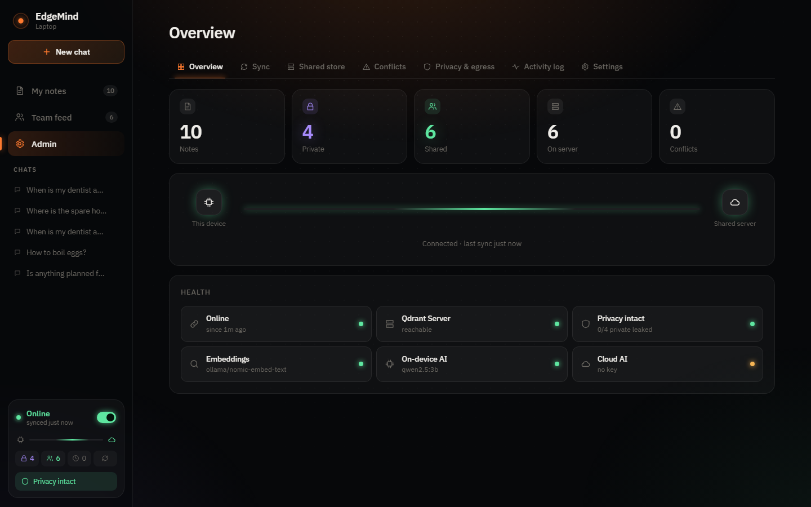

---

## Quick start (Windows)

Prerequisites: Python 3.12, Node 20+, and [Ollama](https://ollama.com) with the local models:

```powershell
ollama pull nomic-embed-text
ollama pull qwen2.5:3b          # on-device answers (phi3 also works as a fallback)
copy .env.example .env          # put GEMINI_API_KEY (or OPENAI_API_KEY) in .env for online generation (optional)
powershell -ExecutionPolicy Bypass -File scripts\start.ps1 -Fresh
python scripts\seed_demo.py     # optional: household demo data (--scenario field for the field-engineer set)
```

Open **http://localhost:8101** (**Laptop**, the desktop UI) and **http://localhost:8102** (**Mobile**, a phone UI) side by side. On a desktop browser the mobile device renders inside a phone frame. Opened on a real phone on the same network (`http://<your-pc-ip>:8102`), it runs full-screen.

Each device serves the UI for its `DEVICE_KIND` (`laptop` or `mobile`), set per device in `scripts/start.ps1`.

After the first setup, double-click **`EdgeMind.bat`** to start everything (Ollama, Qdrant Server, both devices) and open both devices in the browser.

`start.ps1` creates the venv, builds the UI, and starts the Qdrant Server. It reuses a running server if there is one, otherwise starts Docker (`docker compose up -d`), and falls back to the native Qdrant binary, which it downloads to `tools/`. It then starts both device processes. `scripts\stop.ps1` stops the devices; add `-All` to also stop a native Qdrant server.

Run the end-to-end check at any time (it needs both devices running):

```powershell
.venv\Scripts\python scripts\e2e_test.py
```

It covers ingest, hybrid search, push/pull, idempotent re-sync, the privacy audit (egress ledger plus the live server), superseding a note with a newer one, a concurrent-edit conflict, answering offline, and private context staying on the device while online.

### Settings (`.env`)

| Variable | Default | Meaning |
|---|---|---|
| `GEMINI_API_KEY` | none | Cloud model (Gemini) for general and shareable questions. Takes priority over `OPENAI_API_KEY`. Without either key, the on-device model answers everything |
| `GEMINI_MODEL` | `gemini-2.5-flash` | Gemini model name |
| `OPENAI_API_KEY` | none | Cloud model (OpenAI), used when no Gemini key is set |
| `OPENAI_MODEL` | `gpt-4o-mini` | OpenAI model name |
| `QDRANT_URL` / `QDRANT_API_KEY` | `http://127.0.0.1:6333` | The shared Qdrant Server |
| `INTERNET_CHECK` | `1.1.1.1:443,8.8.8.8:443` | Hosts probed to detect internet loss. Empty disables the check (for a LAN-only demo) |
| `LOCAL_LLM` / `LOCAL_LLM_FALLBACK` | `qwen2.5:3b` / `phi3` | On-device models in Ollama |
| `EMBED_MODEL` | `nomic-embed-text` | On-device embedding model |

## Deploy a public demo link (Docker)

One image runs everything: the Qdrant Server, Ollama with the models baked in, both devices, and a gateway on port 7860. The gateway serves:

| URL | What |
|---|---|
| `/` | Judge-facing demo page: the Laptop and the Mobile side by side, live, with a 60-second guided tour |
| `/laptop/` | The Laptop device on its own (desktop UI) |
| `/mobile/` | The Mobile device on its own (phone UI; open this on a phone) |

**Hugging Face Spaces (free):**
1. Create a new Space and choose **Docker** as the SDK (the "Blank" template).
2. Push this repo to the Space. The Space's `README.md` must start with this header:
   ```yaml
   ---
   title: EdgeMind
   emoji: 🧠
   sdk: docker
   app_port: 7860
   ---
   ```
3. In **Settings › Variables and secrets**, add `GEMINI_API_KEY` (or `OPENAI_API_KEY`) as a *secret* (optional, but it makes general questions fast).
4. The first build takes about 10–15 min, because it downloads the models into the image.

Free Spaces sleep when idle and reset stored data on restart. The demo re-seeds itself on every fresh start.

**Any cloud server (about 8 GB of RAM):**
```bash
export OPENAI_API_KEY=sk-...        # optional
docker compose -f docker-compose.deploy.yml up -d --build
```
Then open `http://<server-ip>/`. Data persists in the `edgemind-data` volume.

Deployment settings (environment variables):

| Variable | Default | Meaning |
|---|---|---|
| `GEMINI_API_KEY` / `OPENAI_API_KEY` | none | Cloud AI for general and shareable questions (Gemini wins if both are set); without either, the on-device model answers everything |
| `ASK_RATE_LIMIT` | `20` | Questions per minute per visitor (protects your OpenAI bill); `0` turns it off |
| `SEED_SCENARIO` | `home` | Demo notes loaded on a fresh start (`home` or `field`); set `SEED_DEMO=0` to start empty |

Build argument `BAKE_MODELS=0` gives a smaller image that downloads the models on first start instead.

**Things to be clear about with judges:**
- **Everyone shares the same two devices.** It's a shared demo, not per-visitor accounts.
- **The "on-device" AI runs on the server.** Offline mode on the link is the in-app switch. True on-device privacy, and real no-internet use, is the local setup above.

## Demo script (≈4 minutes)

This uses the household demo data (`python scripts\seed_demo.py`).

1. **Remember.** On the Laptop, click **Save a note** and save an **Only me** note ("My dentist appointment is Thursday 10 Oct at 4:30 pm") and a **Team** note ("Trash and recycling go out every Tuesday night"). Both land in on-device memory instantly (see *My notes*). *Admin › Overview* shows the Team note travel along the sync channel.
2. **Pull on the other device.** The Mobile receives the Team note within a few seconds and shows it in its **Team feed**. The private note never arrives.
3. **Cut the link.** Turn Wi-Fi off, or flip the **Online** switch on the laptop. A "You're offline" banner appears, and the sync channel in *Admin* shows the link cut.
4. **Answer offline.** Ask "What time does Bruno eat?". Hybrid search runs in a few ms and qwen2.5:3b answers on-device, with the note it used listed under *Based on*.
5. **Queue while offline.** Add a Team note. It shows *Waiting to sync* in *My notes*, and the status card shows 1 waiting.
6. **Reconnect.** Turn Wi-Fi back on, or flip the switch. The queue drains automatically and the note turns *Team*.
7. **Conflict.** Take the Mobile offline and edit a shared note. Edit the same note on the laptop, then bring the Mobile back online. *Admin › Conflicts* shows which version won (last write wins), with the other version kept and a one-click restore.
8. **Prove the boundary.** *Admin › Privacy & egress* compares every private id with every outbound request and with the live server. Its egress ledger lists every request that left the device and exactly which notes it carried.
9. **Private context while online.** Ask "When is my dentist appointment?" while online. The answer is labelled *Answered on this device*, and *Why this answer?* explains that a private note matched. A Team-only question ("Where is the spare house key?") goes to the cloud model when a key is set.

## Internals

### Data model

Local record: a point in the device's Qdrant Edge shard. Its vectors are `dense` (768-d, from nomic-embed-text) and `bm25` (sparse, from Qdrant Edge's built-in `Bm25`).

```json
{
  "mem_id": "m_1790761414469_shmj", "text": "The compressor torque spec…", "role": "user",
  "sensitivity": "private", "synced": false, "sync_state": "private",
  "ts": 1790761414469, "updated_ts": 1790761414469,
  "rev": 0, "base_rev": 0, "origin": "device_a", "updated_by": "device_a",
  "embedder": "ollama/nomic-embed-text", "supersedes": null, "superseded_by": null
}
```

Cloud record: a point in `edgemind_shared` on the Qdrant Server. The payload is built from an allow-list of fields, never by copying the local record:

```json
{ "mem_id": "…", "text": "…", "ts": 0, "updated_ts": 0, "rev": 2, "from": "device_a", "updated_by": "device_b",
  "supersedes": null, "superseded_by": null }
```

Point ids are `uuid5(mem_id)`, so a record has the same id on every device and on the server.

### Retrieval
A query runs a hybrid search in Qdrant Edge: a dense prefetch and a BM25 prefetch, fused with RRF (`k=60`). A hit counts as relevant only if its cosine similarity is at least 0.60 and within 0.15 of the best hit. Relevant, non-superseded hits are listed newest first in the prompt, and the model is told to answer only from them and cite them.

### Sync manager (`edge/sync.py`)
1. **Retract**: records that were shared, then re-tagged private or deleted, are replaced on the server by a tombstone. Only the id is sent.
2. **Push**: every record with `sync_state = queued`.
3. **Pull**: new or updated records from other devices, with their vectors. A local copy is dropped only when the server holds an explicit tombstone for it.

A record that's simply missing from the server (reset, wiped, or a different server) is never treated as a deletion. The device re-queues its copy and uploads it again, so the shared store heals itself.

### Conflict policy: last write wins, nothing silently lost
Every shared record has a revision `rev`, and each device remembers the `base_rev` it last synced. On push, if the server's rev still equals `base_rev`, the push is a fast-forward. If the server's rev has moved on, another device edited the record concurrently. The edit with the later `updated_ts` wins, with ties broken by device id. The losing text goes into the conflict log with its author and timestamp, and one click restores it as a new edit.

### Evolving memory
When you save a note, EdgeMind checks for an existing note with cosine similarity ≥ 0.80 and asks whether the new one replaces it. If you confirm, the old note is marked superseded. It is kept and shown struck through, but excluded from answers. The prompt also lists memories newest first, and tells the model to prefer newer facts and mention any disagreement.

## Layout

```
edge/            device service (FastAPI)
  app.py         API, ask/route logic, privacy audit, SSE events
  store.py       Qdrant Edge shard wrapper (hybrid search)
  sync.py        sync manager + conflict policy
  cloud.py       Qdrant Server client + privacy guard
  network.py     connectivity + internet probe, offline gate, egress ledger
  embeddings.py  Ollama embeddings (+ hash fallback), BM25
  llm.py         Ollama + OpenAI streaming, shared prompt
web/             React + Vite UI (served by each device from web/dist)
scripts/         start/stop, seed data, end-to-end test
docs/screenshots README images
data/<device>/   shard, activity log, egress ledger, sync state, chat
```

## Notes and known limits
- **qdrant-edge-py 0.8 cannot filter on bool payload values**, and `MatchValue(False)` silently matches nothing. So sync status is mirrored into an indexed keyword, `sync_state`, which is derived in exactly one place (`store.py`).
- If Ollama is down, notes are still stored, using a hashed bag-of-words vector. They are re-embedded automatically once the model is back. In that mode, relevance falls back to keyword matching.
- On Windows, the device server runs uvicorn on the Selector event loop. The default Proactor loop can permanently lose its listening socket (`WinError 64`) when a browser drops a connection mid-handshake.
- UI development with hot reload: `cd web && npm run dev` (proxies to :8101; set `DEVICE_PORT=8102` to target the Mobile).
- Out of scope for the hackathon: auth, a fleet of more than two devices, and encryption at rest.
